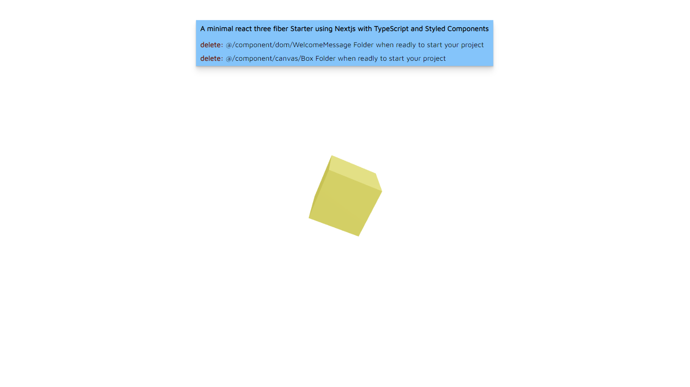

# :ice_cube: Next Three Fiber Starter

### :desktop_computer: Live Demo :

[](https://next-three-fiber-beta.vercel.app/)

:warning:This is my official r3f-next starter. Had a [previous](https://github.com/aliiscript/next-r3f-starter) one but code was all over the place and wasnt happy with organization and have also learned alot more, will leave up tho for those who are using it :warning:

## Minimal react three fiber Starter using [Next.js](https://nextjs.org/) and its new app directory with TypeScript and Styled Components

## How To Use

I pretty much implented the way Renaud ROHLINGER used View from react-three/drei and tunnel to add webGL onto the page since I loved it so much 

Run the following command to create a new project with this Starter:

```
yarn r3f-sketch my-app --template next
# or
npx r3f-sketch my-app --template next
```

